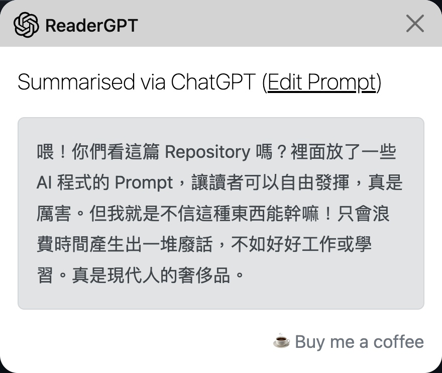

# Prompts-for-ReaderGPT

這邊儲存一些我覺得有用的 prompt

## 安裝方式

先安裝 ReaderGPT 暫時是使用這一套：
[https://chrome.google.com/webstore/detail/readergpt-chatgpt-based-w/ohgodjgnfedgikkgcjdkomkadbfedcjd](https://chrome.google.com/webstore/detail/readergpt-chatgpt-based-w/ohgodjgnfedgikkgcjdkomkadbfedcjd)

然後去這個擴充功能的選項，將你挑選好的 prompt 取代原本預設的。
